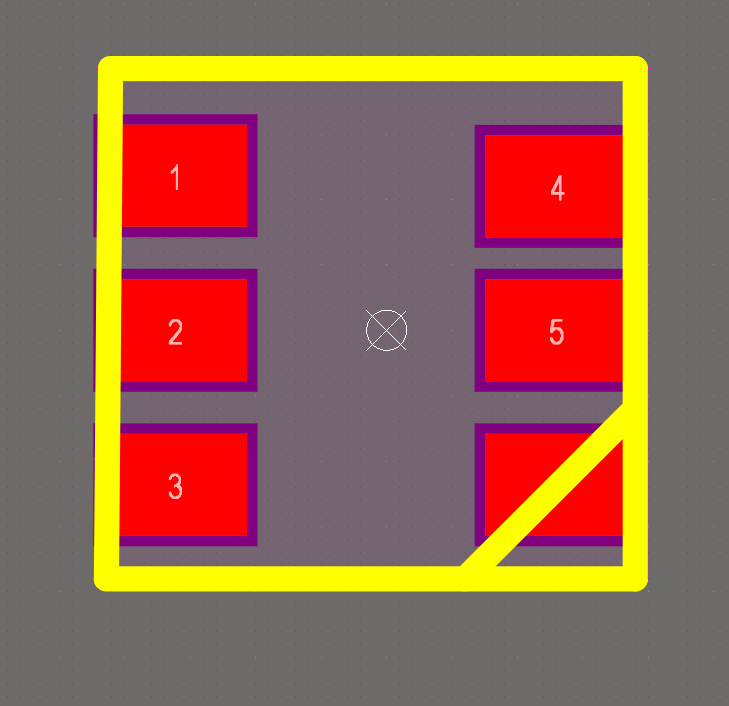
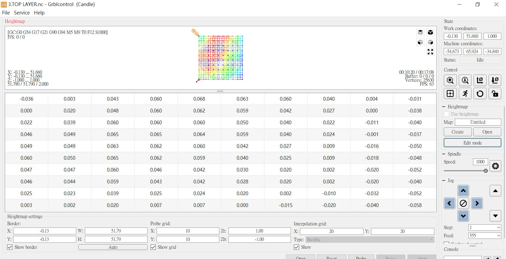

# 燈座展示

本項目為跳板作品來學習3D、製作pcb以及利用環氧樹植來製作透名標本

這個項目的功用非常簡單只有開跟關

## 作品

## 使用技術(軟體)
 - Pcb設計  Alitum designer
 - Cnc路徑模擬  Flatcam
 - Cnc驅動程式  Grblcontrol
 - 3D設計 solidworks

使用falstad.com把每一個端點的電流模擬出來控制在SDM LED 可用範圍

# 原理圖

這次繪製的原理圖是使用SDM_5050_LED並聯,透過可變電阻調節電壓使三級管(NPN)實現放大功率的效果

# 其他焊盤
SDM LED 5050

SDM 電阻

插件式焊盤/過孔

# 3D設計

這次3D外觀是使用FDM 3D列印
分為上蓋、下座、模具
使用組合的方式把電路板夾在中間，中間也有留1.6MM 電路板厚度使電路板可以契合，下座也有設計下凹設計避免焊點突出

# CNC 路線設計FLATCAM

學習來源: https://youtu.be/NuJlgw7E7vg

這邊需要設計雕刻、雷射、切除線路,在本項目中使設計雙層板所以需要顧慮到電路銅板翻面後位置如何改變,使用2-sides功能來實現相對位置鏡像,剩下就是雕刻進刀率以及深度問題

# pcb 製作工藝

## 工藝流程

- cnc雕刻電路銅板
- 阻焊油(綠油)鋪蓋
- 紫外燈照射
- 雷射焊盤位置
- 切除電路板

## cnc雕刻電路銅板

使用cnc將表面的銅雕刻成線路的樣子

### 細節

- 要在電路周圍打上4個相對的點來做為鏡像用途
- 在電路板上面撒上針車油,用途:減少摩擦力、減少灰塵,看個人所需加跟不加我都試過了雕刻出來的電路板都一樣

針車油對比

### highmap功能(重要)

這個功能是在cnc驅動軟體(Grblcontrol)中,它是一個專為pcb設計的一個功能,是使用電路相通的原理來紀錄每一個點之間相差的高度,藉由這些點就可以知道電路板平整度,在雕刻線路板時雕刻的深度往往都在0.1mm左右,所以如果沒有使用這個功能會使線路切不斷的問題

使用鱷魚夾一端夾在鑽頭一端夾電路板

### cnc雕刻數據
- 0.1MM 60度
- Z-CUT = 0.09mm
- Feedrate x-y (x,y給進率)= 80
- Feedtate z (z 給進率)= 100
- Spindle speed(轉速) = 10000

## 阻焊膏塗刷

剛開始用直接刷一次把雕刻的線路都填滿阻焊油,之後使用娟布將綠油刷一層上去,刷上去的密度與娟布的目數有關,目數越高越密集

### 其他方式

使用塑膠板(資料夾減一部分)壓綠油讓綠油擴散
### 娟印層(top overly)

雷射後將白色阻焊油刷上用酒精慢慢擦

## 紫外光照射

使用紫外燈照射15分鐘

這是我自製的紫外燈罩,順便改了一下電路(它是蝦皮上45元的商品我就不說是什麼了)要注意的是它只要開超過15分鐘就會開始發熱如果沒有關掉可能會燒掉,所以我之後再它下面放了一塊銅板讓它導熱

## 雷射除綠油

雷射除綠油是目前最有效率的方式

### 重點
- 如果有要買雷射頭要注意雷射頭使否可以用夾頭夾住不用另外鎖螺絲

- 鎖螺絲的壞處是要花很多時間校正

- 使用雷射時需要代電工眼鏡可以濾掉藍光

### 雷射數據
- Power = 250
- Feedrate w-y = 1000
- Z軸高度需要用電工眼鏡看是否聚焦

### 雷射完

### 清潔

## 鍍錫
鍍錫目的使錫附著在銅上,焊接時可更容易

使用銅鍍席鎳劑,使用浸鍍的方式

浸鍍3分鐘,浸鍍前需要將銅表面利用砂紙磨一下上銅表面粗糙一點,浸鍍時才比較容易附著

## 切除電路板

### 外框切除數據
- 工具2mm 铣刀
- 1.Z-CUT = 0.4MM (铣一圈)
- 2.Z-CUT = 0.8MM (铣一圈)
- 3.Z-CUT = 1.1MM (铣一圈)
- 4.Z-CUT = 1.8MM (留四個連接點)

### 焊接

## 環氧樹植模具拆除
 

 使用cnc除模不是一個理智的作法,我最後使用熱風槍慢慢剝除外殼
 
 剝除後用砂紙磨到光滑
## 鉚釘

這是一板廠做出來的pcb,在洞裡都有做附銅,而我們做出來的中間是絕緣層(FR4),所以我們需要使用到鉚釘來讓兩邊相通

## 最後的一些心得及建議
cnc製作pcb是一個相對來說成本較高的做法,pcb的做法非常的多,也有相對便宜的熱轉印,每一個做法的目的都是一樣的,在網路上做法同一種但每一個的細節做法都不太一樣,做法的排列組合實在太多了,所以我把我的做法整理出來給需要的人

在製作pcb這塊,我做完我還是比較推薦交給板商做,如果真的有興趣再來,推薦的pcb板商:JLBPCB、嘉立創

製作這個燈座費時4個月多,每個軟體都是第一次學,花最多時間的是製作pcb,光失敗就超過10次,太多因素需要考量,機器螺絲的鬆緊會影響轉軸,轉軸上需要上潤滑膏,highmap沒有設定...太多了,別人是做中學,我是錯中學,在失敗中也算是交齊了學費

下面是失敗作品

